# Guardian Dogs

Guardian Dogs is a page for all guardian dog lovers and those who are in doubt whether a guardian dog is what they need. This page contains general information about guardian dogs, their training and breeds. View the live site [here](https://0-ana.github.io/guardian-dogs/)

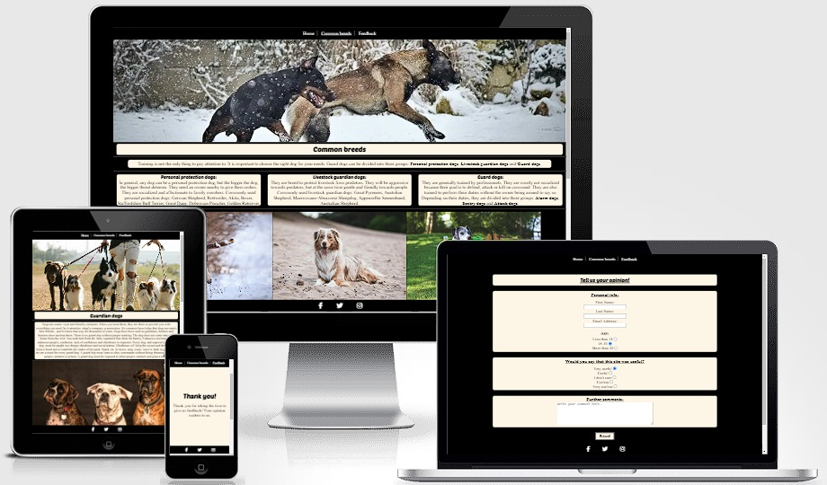

## Features

#### Through all three pages

* Navigation bar
  * contains links to the Home, Common breeds and Feedback pages and will be responsive on all devices.
  * allows the user to easily navigate between the three pages without having to use the back button

* Footer
  * contains icons and links for Facebook, Twitter and Instagram
  * allows the user access on all three pages

#### Home page

* Home page main image
  * contains the main image on the homepage
  * immediately lets the user know that the page is about dogs

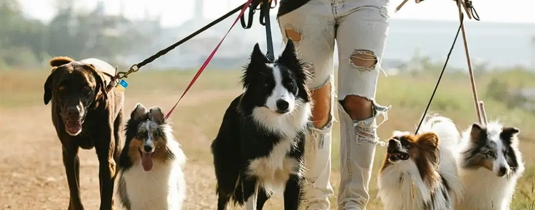

* h1 title
  * contains the main title of the home page
  * lets the user know what the page is about

* About guardian dogs
  * contains general text about guardian dogs and their training
  * It helps the user see if it's something they're willing to commit to

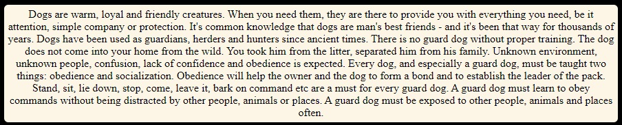

* First two images on home page

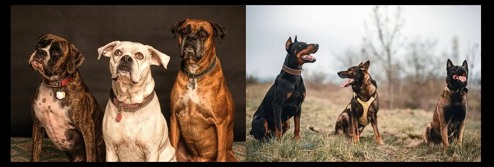

* Benefits of having guardian dog
  * contains some of benefits of having guardian dog

* Second two images on home page

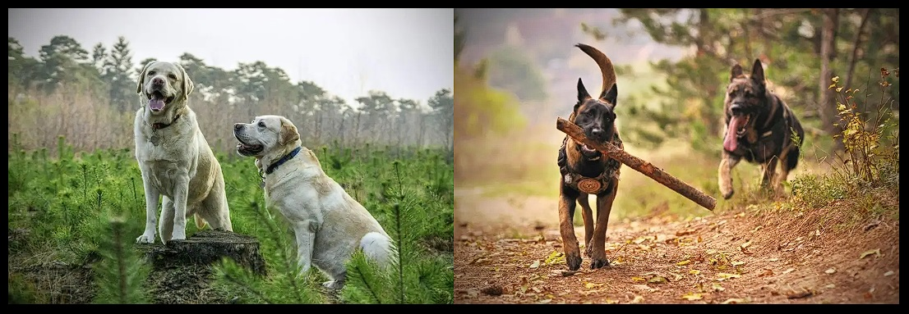

* Quotes section
  * contains 4 quotes about dogs

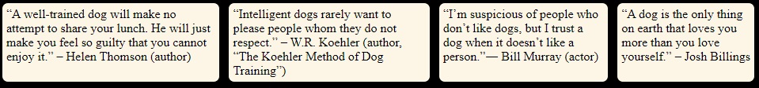

#### Common breeds page

* Common breeds page main image
  * contains the main image on the common breeds page

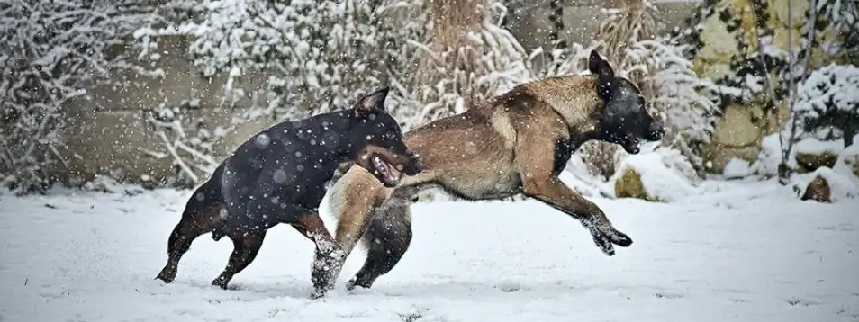

* h1 title
  * contains the main title of the common breeds page

* Three main types of guardian dogs
  * contains a description of three types of guardian dogs

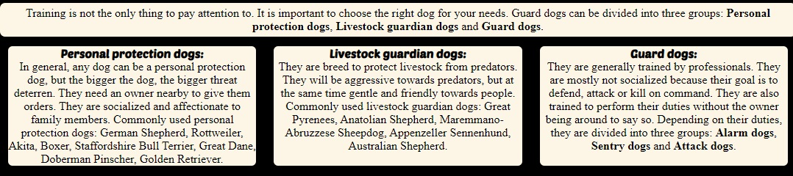

* First three images 

 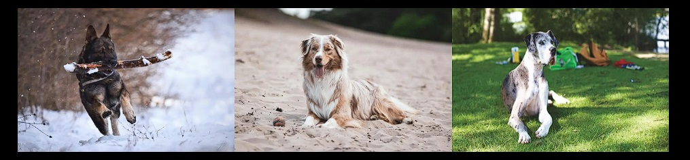

* Guard dogs types
  * contains a description of three types of guard dogs 

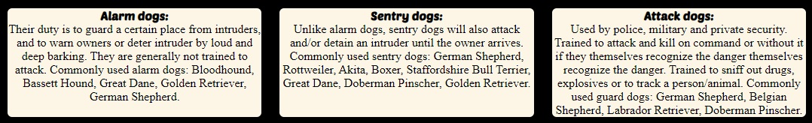

* Second three images 

 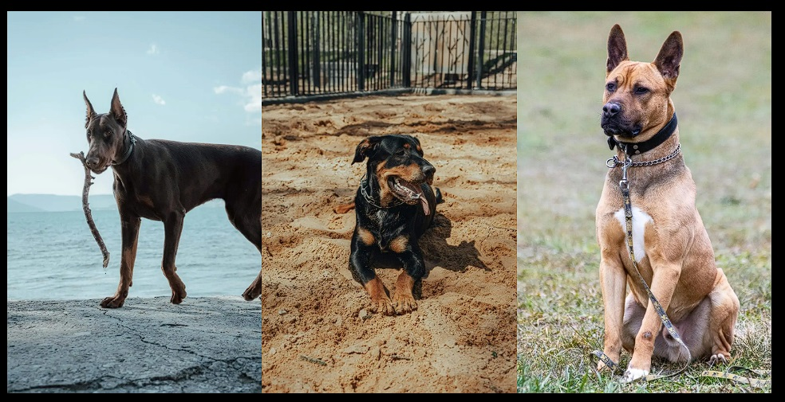

#### Feedback page

* Contact form
  * this page will allow the user to evaluate the usefulness of the page and to leave an additional comment if he wishes

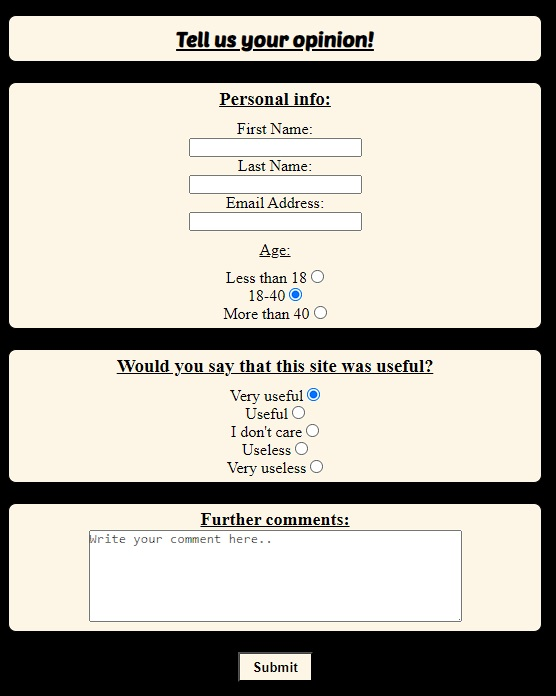

* Thank you page
  * when the user fills in the feedback, he will be sent to a page that thanks him for his time invested

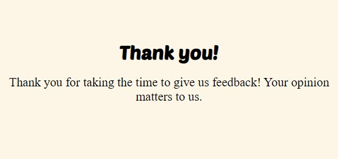

## Technologies

* HTML
  * The structure of the Website was developed using HTML as the main language.
* CSS
  * The Website was styled using custom CSS in an external file.
* Gitpod
  * The website was developed using Gitpod.
  * Gitpod was used to commit and push code to GitHub.
* GitHub
  * Source code is hosted on GitHub
  * Webpage is deployed using from Github
* Favicon
  * Favicon files were created at https://favicon.io/favicon-converter/ 
* Icons
  * Icons obtained from https://fontawesome.com/ were used in the footer section.
* Google Fonts
  * Text was styled using fonts from https://fonts.google.com/
* Balsamiq Wireframes
  * wireframes were created using balsamiq from https://balsamiq.com/wireframes/desktop/#

## Wireframes 

Balsamiq Wireframes were used as the initial idea for design of the website. In the end, it didn't turn out exactly the same as in the pictures because of the appearance itself.

* Home page

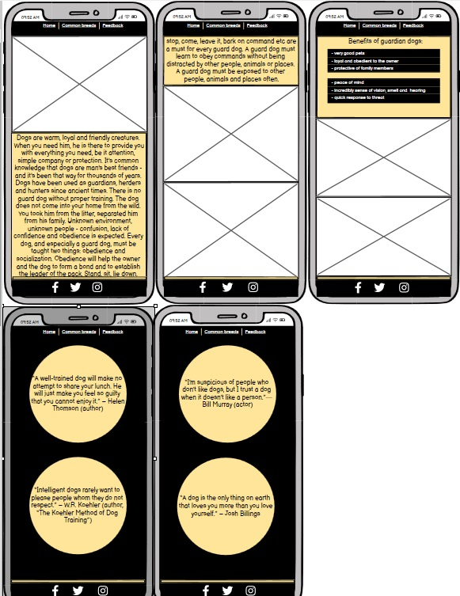

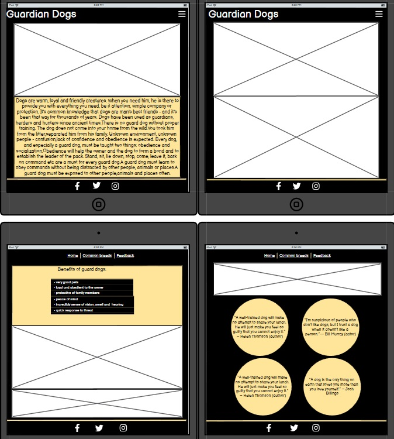

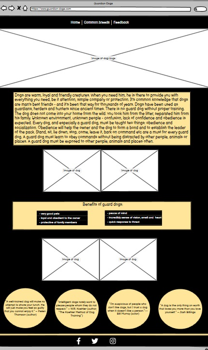

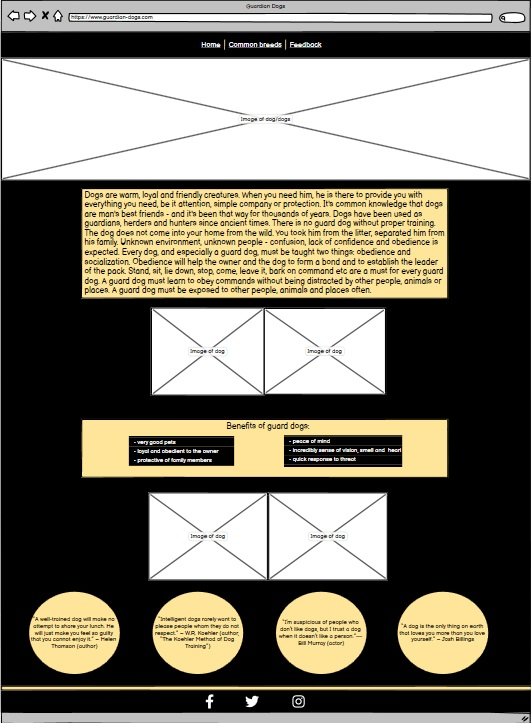

* Common brees page

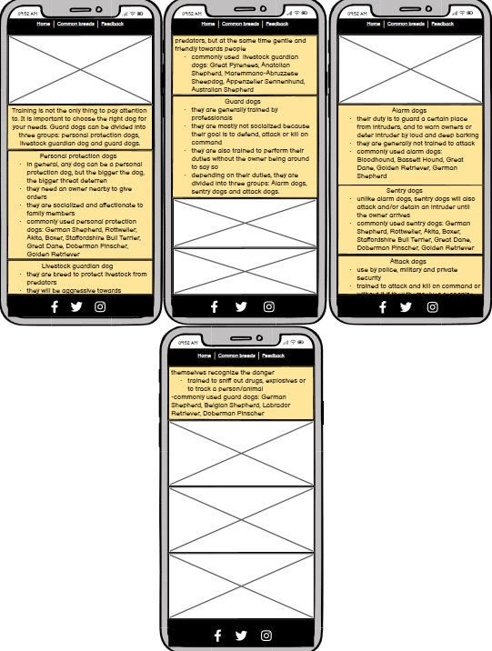

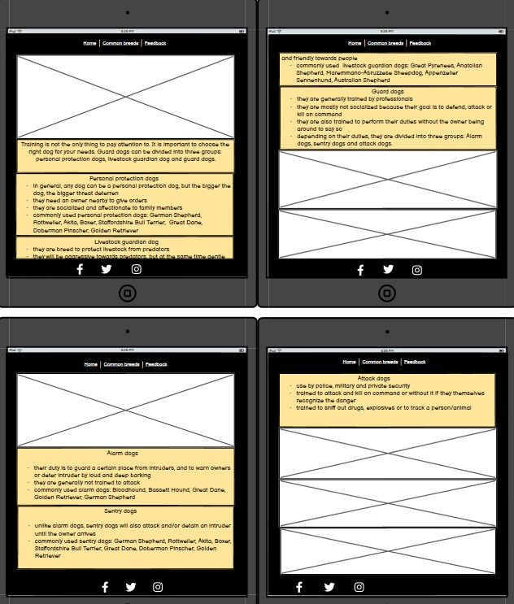

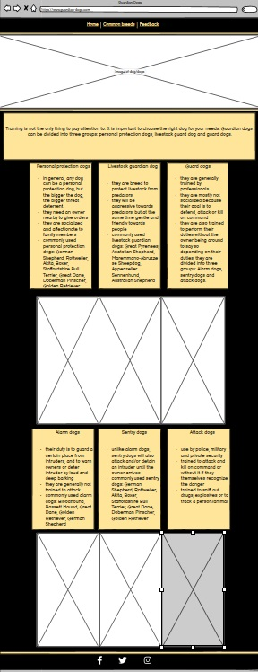

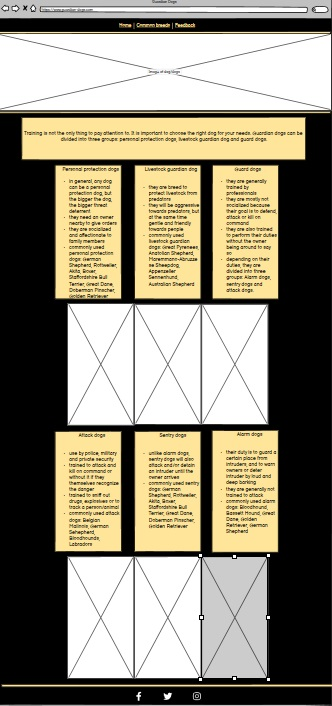

* Feedback page

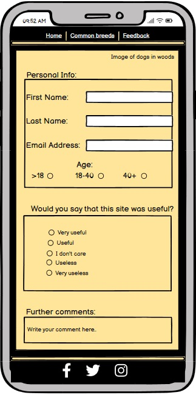

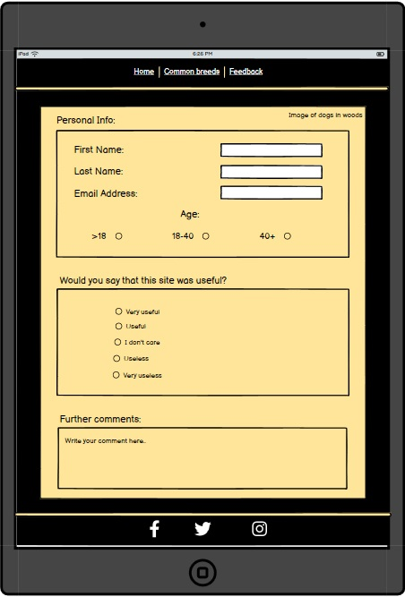

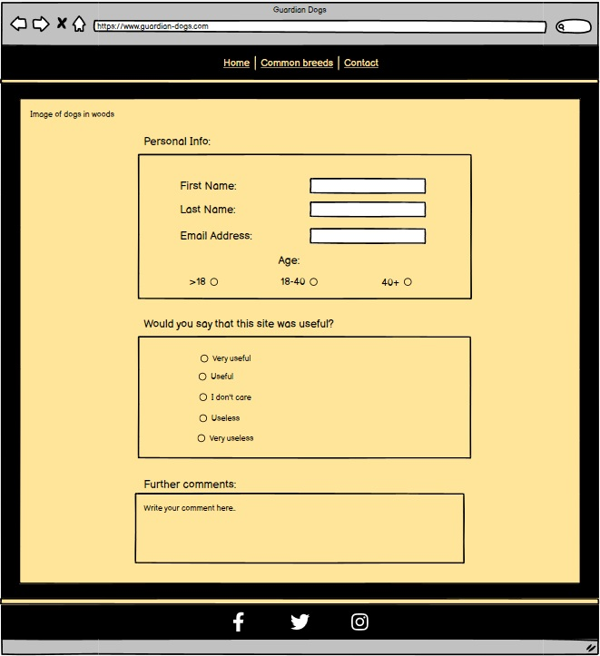

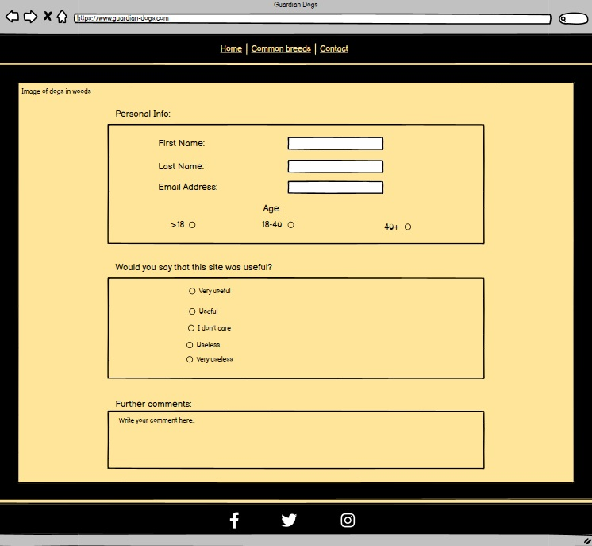

## Testing

* Responsiveness
  * All pages were tested to ensure responsiveness on screen sizes from 280px and upwards
  * the website works as planned on all sreen sizes

* Validator Testing
  * HTML validator https://validator.w3.org/
    * the only drawback is that there are no titles in all sections, however this is not a page where titles are needed

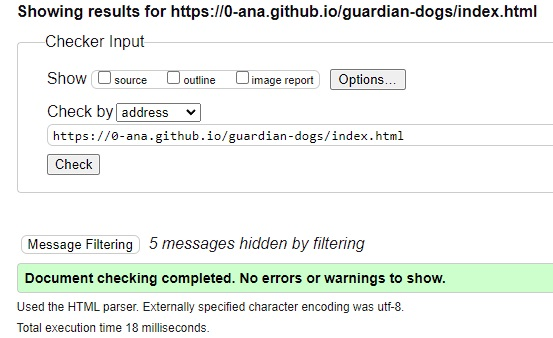
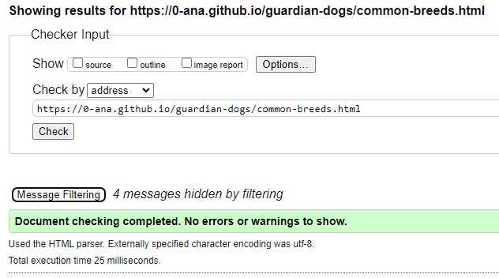
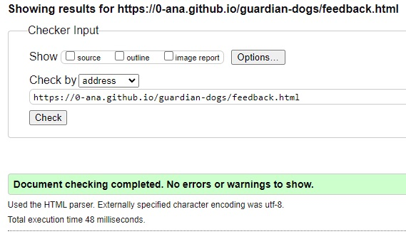

  * CSS validator https://jigsaw.w3.org/css-validator/

* Lighthouse
  * Home page

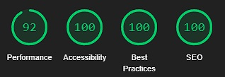
  * Common breeds page

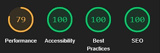
  * Feedback page

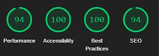

* Accessibility
  * Wave Accessibility tool was used to test accessibility: https://wave.webaim.org/

* Functional Testing
  * all internal and external links works properly

## Deployment

* The site was deployed to GitHub pages. The steps to deploy are as follows:
  * In the GitHub repository, navigate to the Settings tab
  * From the menu on left select 'Pages'
  * From the source section drop-down menu, select the Branch: main
  * A live link will be displayed in a green banner when published successfully.
The live link can be found here - https://0-ana.github.io/guardian-dogs/

## Credits

* Content
  * text about guardian dogs, their training and breeds are taken from:
    * https://www.3dk9detection.com/news/dog-guide-the-5-key-difference-between-a-guard-dog-and-a-protection-dog
    * http://protegek9.com/en/education-center/guard-dogs-and-sentry-dogs
    * https://www.goodhousekeeping.com/life/pets/g22997516/best-guard-dogs/
  * quotes are taken from:
    * https://www.care.com/c/the-101-best-dog-quotes
  
* Media
  * images are takeon from:
    * https://www.pexels.com/
      * they are resized using https://imageresizer.com/ and paint tools
      * sizes of images are reduced using https://tinypng.com/
      * images are converted from jpg to webp using https://convertio.co/jpg-webp/
